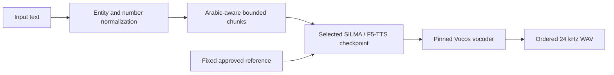

# MasriSwitch-TTS

Reproducible Egyptian Arabic ↔ English code-switched text-to-speech for voice-agent
experiments, fine-tuned from [SILMA TTS v1](https://huggingface.co/silma-ai/silma-tts)
using the F5-TTS architecture.

**Status: experimental.** Training and release checks are complete, but E1 did
**not** meet the declared accuracy target. Pronunciation, English words, IDs,
and numbers can be wrong. The published model is a research result and is not
ready for production voice agents.

[Try the demo](https://huggingface.co/spaces/Tarek737/MasriSwitch-TTS-Demo) ·
[Model and weights](https://huggingface.co/Tarek737/MasriSwitch-TTS) ·
[Text benchmark](https://huggingface.co/datasets/Tarek737/MasriSwitch-Bench) ·
[Evaluation report](reports/EVALUATION.md)

## Try the public demo

1. Open the [Hugging Face Space](https://huggingface.co/spaces/Tarek737/MasriSwitch-TTS-Demo).
2. Enter a sentence of up to **200 characters** and select **Generate speech**.
3. Wait for the free GPU queue, then play or download the 24 kHz WAV.

Example inputs:

```text
ال order جاهز للتوصيل.
ممكن تعمل reset لل password؟
```

The demo uses one fixed voice with documented speaker consent. All output is
**AI-generated**. Long text is normalized and split at Arabic/English punctuation
or word boundaries before synthesis. Free ZeroGPU quotas and queues apply.

The public runtime uses 16 inference steps, PyTorch/torchaudio 2.8.0, and
Gradio 5.25.2. The original benchmark used PyTorch/torchaudio 2.6.0 and a
separate private reference voice; its scores are not a measurement of the
current demo voice or the later serving fixes.

## Measured results

E0 and selected E1 were measured on the same **489-prompt plan**: 189 validation
prompts and 300 locked benchmark prompts, with the same private reference,
seed, and 16-step inference protocol.

| Model | Code-switch WER ↓ | English EER ↓ | Arabic-only CER ↓ | Critical entity accuracy ↑ |
|---|---:|---:|---:|---:|
| E0 — untouched SILMA | 61.38% | 51.60% | 38.57% | 10.19% |
| E1 — selected fine-tune | 61.34% | 52.53% | 38.03% | 10.19% |

WER measures word errors; EER measures English entity errors; CER measures
character errors on Arabic-only prompts. Code-switch WER covers 412 mixed
prompts; Arabic-only CER covers 77 prompts. These are independent ASR proxy
scores, not human naturalness ratings. Mean real-time factor was 0.308 for E0
and 0.305 for E1; both produced zero invalid audio outputs.

The target was **≥15% relative code-switch WER reduction or ≥25% relative English
EER reduction**. E1 achieved only 0.06% relative WER reduction, while English
EER worsened by 1.80% relative. Arabic-only CER and latency guardrails passed.
See [EVALUATION.md](reports/EVALUATION.md) for confidence intervals, protocol,
validation selection, and failure examples.

### Checkpoint selection

Training stopped at **5,000 updates** after three consecutive stale validation
checks. The 4,000- and 5,000-update checkpoints also failed the Arabic guardrail
on the frozen screening subset. Eligible 1,000-, 2,000-, and 3,000-update
checkpoints were compared on all 189 validation prompts. **Update 2,000** was
selected by English EER, then code-switch WER, subject to the Arabic guardrail.
The 300 locked benchmark prompts were excluded from selection.

### Long-sentence diagnosis

A reported long sentence expanded from 192 to 259 characters after number/ID
normalization. The upstream splitter emitted one 416-byte chunk despite its
256-byte budget. The serving fix enforces a UTF-8 byte limit and recognizes
Arabic punctuation; this sentence now produces five ordered audio pieces.
An incorrect ID matcher that spelled ordinary English words was also corrected.

A bounded comparison used the same checkpoint, approved demo voice, and seed:

| One diagnostic prompt only | Arabic-decoder WER ↓ | Synthesis time on T4 |
|---|---:|---:|
| Legacy splitting, 16 steps | 80.85% | 4.761 s |
| Bounded chunks, 16 steps | 76.60% | 6.271 s |
| Bounded chunks, 32 steps | 78.72% | 12.759 s |

Chunking recovered the ending in the automatic transcript, but aggregate
error metrics were mixed and entity errors remain. Moving to 32 steps gave
no proxy accuracy gain on this prompt and took **2.03×** as long; the demo
retains 16 steps. This diagnostic does not establish a general quality gain.
Hashes, other metrics, and limitations are in [QUALITY_REVIEW.md](reports/QUALITY_REVIEW.md).

## Improving quality

**Do not extend the current E1 run with the same data and recipe.** Later
checkpoints did not improve the eligible metrics, and the original accuracy
target remains unmet. More updates alone are not supported by this evidence.

The recommended next experiment has not been run:

1. **Compare E0 and E1 fairly.** Use fresh development prompts with the same
   approved voice, current normalization/chunking, seed, and 16 inference steps.
   Include short and long text, language switches, IDs, prices, and times.
2. **Identify the errors.** Save paired audio, annotate wrong/missing/repeated
   words, and combine ASR scores with blind human listening. Keep evaluation
   holdouts separate from tuning.
3. **Review training data.** Check transcript/audio alignment, Egyptian
   pronunciation, English coverage, and entity examples. D1 is synthetic;
   limited speaker diversity is a possible constraint, not an established cause.
   Any additional recordings require verified source terms and speaker consent.
4. **Gate a new experiment with a small pilot.** Change the data or recipe only
   when the diagnosis supports it. Pass a bounded correctness probe and pilot
   before a longer run, then select on validation and evaluate on the held-out set.

No further training was started for this review. Optional E2 replay is unrun;
its Common Voice revision and terms remain unverified.

## Architecture



The data pipeline is separate: source lock → row-level license gate → audio/text
quality audit → deduplication → grouped 90/5/5 split → F5 Arrow training dataset.

- **Training:** deterministic seeds, verified archives/checkpoints, resumable
  Kaggle stages, bounded probes, and validation-based early stopping.
- **Serving:** FastAPI and Gradio, hash-checked artifacts, fixed approved voice,
  and AI-generated audio disclosure. Arbitrary voice uploads are not supported.
- **Release:** measured E0/E1 evidence and a fail-closed license/provenance gate
  before weights can be bundled for publication.

## Data and licenses

The D1 source is
[`abdo1819/arabic-english-code-switching-synthetic-asr`](https://huggingface.co/datasets/abdo1819/arabic-english-code-switching-synthetic-asr),
pinned at `eae9a87c17e91e3f59a9696d5f4ff3eb51502e82`.

| Audit stage | Count |
|---|---:|
| Source rows | 9,617 |
| Eligible author-created CC BY 4.0 rows | 3,944 |
| Excluded CC BY-NC-SA 4.0 rows | 5,673 |
| Final prepared clips | 3,786 |
| Train / validation / test | 3,414 / 189 / 183 |

Prepared audio totals 8.066 hours. D1 supplies no speaker IDs, so the splits
are not speaker-disjoint. [MasriSwitch-Bench v1](https://huggingface.co/datasets/Tarek737/MasriSwitch-Bench)
contains **1,200 text-only prompts**, including 300 locked test IDs; its downloaded
JSONL hash was verified. Its prompts are templated, and no human naturalness
study or external real-speech evaluation has been completed.

Repository code and SILMA weights are Apache-2.0; SILMA source code and F5-TTS
code are MIT. Eligible D1 rows are CC BY 4.0, attributed to Abdelrahman R. Hashem.
The mixed-license D1 dataset as a whole is **not** a release-safe training source.
See [LICENSE](LICENSE), [NOTICE](NOTICE), and [DATA_AUDIT.md](reports/DATA_AUDIT.md).

Raw third-party audio, checkpoints, credentials, caches, and consent records
are excluded from Git. The approved demo recording is held privately as runtime
secrets. SILMA's example recording is used only in private tests because public
speaker consent was not documented.

## Local development on Windows

Use **Python 3.10**, Git, and a drive with enough free space for model/data files.
For this workspace, set every cache and temporary directory on D **before**
installing packages or downloading artifacts. Use the existing checkout, or
clone it with `git clone https://github.com/tarekamr737/MasriSwitch-TTS.git D:\MasriSwitch-TTS`.

```powershell
Set-Location D:\MasriSwitch-TTS
$env:HF_HOME = "$PWD\artifacts\hf-cache"
$env:HF_DATASETS_CACHE = "$env:HF_HOME\datasets"
$env:PIP_CACHE_DIR = "$PWD\artifacts\pip-cache"
$env:UV_CACHE_DIR = "$PWD\artifacts\uv-cache"
$env:TEMP = "$PWD\artifacts\tmp"
$env:TMP = $env:TEMP
New-Item -ItemType Directory -Force -Path $env:TEMP | Out-Null
py -3.10 -m venv .venv
.\.venv\Scripts\python.exe -m pip install -e ".[data,train,eval,serve,dev]"
```

Skip virtual-environment creation if it already exists. Tokens belong in shell
environment variables. [.env.example](.env.example) documents the settings;
it is not loaded automatically. GNU make is optional on Windows. The equivalent
of `make check` is:

```powershell
.\.venv\Scripts\python.exe -m ruff format --check src tests scripts
.\.venv\Scripts\python.exe -m ruff check src tests scripts
.\.venv\Scripts\python.exe -m mypy src
.\.venv\Scripts\python.exe -m pytest -q
.\.venv\Scripts\python.exe -m masriswitch.cli validate-config
```

### Local API and Gradio

After restoring the matching artifacts listed below, install the serving and
inference dependencies into your Python 3.10 environment:

```bash
python -m pip install -e ".[train,serve]"
make bootstrap
make api   # http://127.0.0.1:8000/docs
# In another terminal using the same environment:
make demo  # http://127.0.0.1:7860
```

On Windows, use `.\.venv\Scripts\masriswitch.exe api` and
`.\.venv\Scripts\masriswitch.exe demo`. A fresh clone contains source code,
not the private training artifacts or approved voice; installation alone does
not make synthesis ready.

Synthesis requires `artifacts/train_manifest.json`, its selected checkpoint,
the bootstrapped SILMA/Vocos files, and a consented fixed reference recording.
Put that recording in `artifacts/reference/`, then create `approved.json`
beside it with the following fields, using the recording's real SHA256 and
exact transcript. Set the approval flags to true only after documenting the
speaker's consent for public use:

```json
{
  "filename": "consented.wav",
  "sha256": "REPLACE_WITH_RECORDING_SHA256",
  "transcript": "REPLACE_WITH_EXACT_TRANSCRIPT",
  "speaker_consent_documented": false,
  "public_use_approved": false
}
```

Until that approval exists, `/health` reports unavailable, `/normalize` works,
and `/synthesize` returns 503. `/model-info` identifies the model and discloses
AI-generated audio. The Gradio demo accepts text only and keeps generation
disabled. The upstream example voice is authorized for private tests only.

## Reproduce the experiments

The published result is tied to the following identities:

| Artifact | Pinned revision / SHA256 |
|---|---|
| SILMA base revision | `226dd7a65cadf51f9a6dbe3953fc89003b3844d5` |
| F5-TTS 1.1.7 commit | `c96c3aeed84f5e02aa54dc42c1193537ead39837` |
| Published E1 model revision | `de6cd6819e719876909437cc33ca7086cff369c9` |
| Selected checkpoint SHA256 | `558e2ab53e1b5450bcd1a1c30683a1b3e6be1234b7e198b74209f362693eaf92` |
| Evaluation plan SHA256 | `26dc087cabc32544c401eebcaaf804185901cbd829358f6c795e0d232ced9185` |

All generated evidence is written under ignored `artifacts/`. Human summaries
are committed under `reports/`. A fresh reproduction creates its own source
lock, audit, split, baseline, training, evaluation, and release-gate evidence;
private audio archives and voice approval are not shipped in this repository.

<details>
<summary><strong>Setup, data audit, Kaggle probes, training, evaluation, and release commands</strong></summary>

Use Python 3.10 and Git. Run these commands in the cloned repository.
This workflow downloads model/data artifacts; GPU training runs only in the
bounded Kaggle stages below. Measure E0 before starting E1.

```bash
python3.10 -m venv .venv
source .venv/bin/activate
export HF_HOME="$PWD/artifacts/hf-cache"
export HF_DATASETS_CACHE="$PWD/artifacts/hf-cache/datasets"
export PIP_CACHE_DIR="$PWD/artifacts/pip-cache"
export UV_CACHE_DIR="$PWD/artifacts/uv-cache"
export TMPDIR="$PWD/artifacts/tmp"
mkdir -p "$TMPDIR"
make setup
make check
git clone --depth 1 --branch 1.1.7 https://github.com/SWivid/F5-TTS.git artifacts/upstream/f5-tts
masriswitch lock-sources
make audit-data
make prepare-data
make bootstrap
make benchmark
python -c "from masriswitch.config import Paths; from masriswitch.train.patch_f5 import stage_training_code; stage_training_code(Paths())"
python -c "from masriswitch.config import Paths; from masriswitch.eval.plan import build_e0_plan; build_e0_plan(Paths())"
```

Training runs in a private two-T4 Kaggle notebook. Package the source with
`python scripts/build_kaggle_bundle.py --stage pilot` or `--stage e1`, attach a
signed private archive URL as
`MASRISWITCH_ARCHIVE_URL`, then use `make train-pilot` or `make train` in that
runtime. `make train` is capped at 1,000 updates by default; use
`masriswitch train --max-updates N` for later bounded stages. Resume requires
`--resume`, `MASRISWITCH_RESUME_CHECKPOINT_URL`, and
`MASRISWITCH_RESUME_CHECKPOINT_SHA256`. The matching archive, patch, pilot, and
full-data probe manifests must be present under `artifacts/`. Both commands
support `--dry-run`, `--max-samples`, and `--seed`; `make eval` aggregates pinned
evaluation rows. No signed URLs or checkpoint bytes belong in the repository.

### First-run Kaggle preparation

Create the audited archives on the machine holding the prepared audio:

```bash
python scripts/archive_pilot.py --root . --output artifacts/pilot.tar.gz
cp artifacts/pilot.tar.json artifacts/kaggle_pilot_archive.json
python scripts/archive_full.py --root . --output artifacts/full_train.tar.gz --dry-run
python scripts/archive_full.py --root . --output artifacts/full_train.tar.gz
cp artifacts/full_train.tar.json artifacts/kaggle_full_archive.json
python scripts/build_kaggle_bundle.py --stage probe --output artifacts/probe.zip
```

Keep archives private. Transfer the probe bundle to a fresh private Kaggle
T4×2 session, extract it, and set `MASRISWITCH_ARCHIVE_URL` to the pilot
archive's private download URL. From the extracted project, run:

```bash
python -m pip install --no-deps -e .
PILOT_SHA=$(python -c "import json; print(json.load(open('artifacts/kaggle_pilot_archive.json'))['archive_sha256'])")
ARROW_SHA=$(python -c "import json; print(json.load(open('artifacts/kaggle_pilot_archive.json'))['pilot_arrow_sha256'])")
python scripts/kaggle_train_probe.py --root . \
  --archive-url "$MASRISWITCH_ARCHIVE_URL" --archive-sha256 "$PILOT_SHA" \
  --arrow-sha256 "$ARROW_SHA" --archive-manifest artifacts/kaggle_pilot_archive.json \
  --patch-manifest artifacts/train_patch.json --max-samples 343 --seed 42 --dry-run
# Repeat without --dry-run to perform the bounded 20-update probe.
```

Download `/kaggle/working/masriswitch_probe_result.json` as local
`artifacts/train_probe.json`. Only after it passes, build `--stage pilot` and
run `masriswitch train-pilot --dry-run`, then `masriswitch train-pilot` in a
fresh private session, installing the extracted project there with the same
`python -m pip install --no-deps -e .` command. Save its
`masriswitch_pilot_result.json` as `artifacts/pilot_500_result.json`.

Next build `--stage full-probe`, use the full archive URL, and run:

```bash
FULL_SHA=$(python -c "import json; print(json.load(open('artifacts/kaggle_full_archive.json'))['archive_sha256'])")
ARROW_SHA=$(python -c "import json; print(json.load(open('artifacts/kaggle_full_archive.json'))['train_arrow_sha256'])")
python scripts/kaggle_full_probe.py --root . \
  --archive-url "$MASRISWITCH_ARCHIVE_URL" --archive-sha256 "$FULL_SHA" \
  --arrow-sha256 "$ARROW_SHA" --archive-manifest artifacts/kaggle_full_archive.json \
  --patch-manifest artifacts/train_patch.json --probe-result artifacts/train_probe.json \
  --pilot-result artifacts/pilot_500_result.json --max-samples 3414 --seed 42 --dry-run
# Repeat without --dry-run for the bounded full-data probe.
```

Save `masriswitch_full_probe_result.json` as `artifacts/full_probe_result.json` before building
`--stage e1`. Run training in 1,000-update stages and resume from the previous
checkpoint URL and verified hash. Each probe/training session supplies its
own Python 3.10 environment; install this project before using its CLI.
Stop on failed probes, invalid audio, or three stale validation checks.

For the selected E1 evaluation, build an `--stage eval` bundle and extract it
in a private Kaggle T4×2 session. Set `E1_CHECKPOINT_URL` to the selected
checkpoint's private output URL, then run from the extracted project:

```bash
python scripts/kaggle_e0_eval.py \
  --plan artifacts/e0_eval_plan.jsonl \
  --plan-sha256 26dc087cabc32544c401eebcaaf804185901cbd829358f6c795e0d232ced9185 \
  --eval-stage E1 --subset all --max-samples 489 --seed 42 \
  --checkpoint-url "$E1_CHECKPOINT_URL" \
  --checkpoint-sha256 558e2ab53e1b5450bcd1a1c30683a1b3e6be1234b7e198b74209f362693eaf92 \
  --dry-run
# Repeat the same command without --dry-run after the plan check passes.
# Add --resume only when resuming matching, persisted output rows.
```

For E0, use the same evaluation command with `--eval-stage E0` and omit both
checkpoint arguments. The evaluator downloads the pinned untouched SILMA
weights. Download `e0_all_eval_rows.jsonl` as `artifacts/e0_eval_rows.jsonl`
and run `make eval` to aggregate the baseline before training.

After downloading `e1_all_eval_rows.jsonl` into local `artifacts/`:

```bash
masriswitch eval --stage E1 --subset all --max-samples 489 \
  --rows artifacts/e1_all_eval_rows.jsonl \
  --checkpoint-sha256 558e2ab53e1b5450bcd1a1c30683a1b3e6be1234b7e198b74209f362693eaf92
python scripts/finalize_training.py --result artifacts/e1_2000_result.json \
  --checkpoint artifacts/checkpoints/e1_2000.pt
python scripts/finalize_evaluation.py \
  --e1-metrics artifacts/e1_all_558e2ab53e1b_metrics.json \
  --e1-rows artifacts/e1_all_eval_rows.jsonl
python scripts/render_model_card.py
make release-check
make release
```

The finalizer requires the verified stage result, audited archive manifest,
and validation-only `checkpoint_selection.json`. These are generated by the
training, `review_e1_progress.py`, and `select_e1_checkpoint.py` stages; they
must accompany a resumed run. The commands above describe the selected run
and will fail closed if its evidence or hashes are missing.

</details>

### Stable commands

| Command | Purpose |
|---|---|
| `make setup` / `make check` | Install dependencies / format, lint, types, tests, config validation |
| `make audit-data` / `make prepare-data` | Verify eligibility / produce audited training artifacts |
| `make bootstrap` / `make benchmark` | Fetch pinned upstream assets / build text prompts |
| `make train-pilot` / `make train` | Run gated, bounded Kaggle training stages |
| `make eval` | Aggregate measured evaluation rows |
| `make api` / `make demo` | Start the local FastAPI / Gradio application |
| `make release-check` / `make release` | Verify publication gates / build a local release bundle |

`make release` does not upload automatically. To inspect the public Space source
bundle, run `python scripts/deploy_space.py --dry-run`. Deployment requires
`HF_TOKEN` and the approved local reference. See [deploy/space](deploy/space)
for the pinned ZeroGPU runtime.

## Reports and project layout

| Location | Contents |
|---|---|
| [src/masriswitch](src/masriswitch) | Data, text normalization, training gates, evaluation, and serving |
| [configs](configs) | Source revisions, data policy, experiment and evaluation settings |
| [scripts](scripts) | Kaggle probes, checkpoint selection, evidence finalization, deployment |
| [tests](tests) | Public API, transformations, safety gates, and serving regression tests |
| [reports](reports) | Durable measured findings and release documentation |
| `artifacts/` | Ignored generated audio, models, caches, and machine-readable evidence |

Key reports: [data audit](reports/DATA_AUDIT.md), [baseline](reports/BASELINE.md),
[evaluation](reports/EVALUATION.md), [quality review](reports/QUALITY_REVIEW.md),
[checks](reports/CHECKS.md), and [model card](reports/MODEL_CARD_DRAFT.md).
